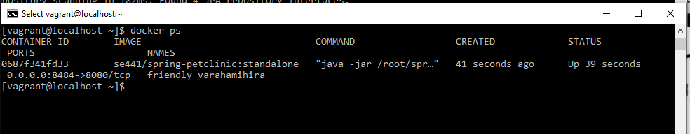

# Submission
Anna Slowinski (Student ID: 1256681)

# Deliverables
- [5 pts] Your dockerfile. Please provide a link to this file rather than a screen capture. 

- [5 pts] Your running docker instance as shown by a ps command.  

- [5 pts] Your browser accessing the main page of the website from your local container. 
I couldn’t get this working fully. I had issues when trying to install docker on Windows and then had issues when trying to get this working through Vagrant. I’ve taken screenshots where I was able to do so and have included the Vagrantfile I used to build the docker image.
